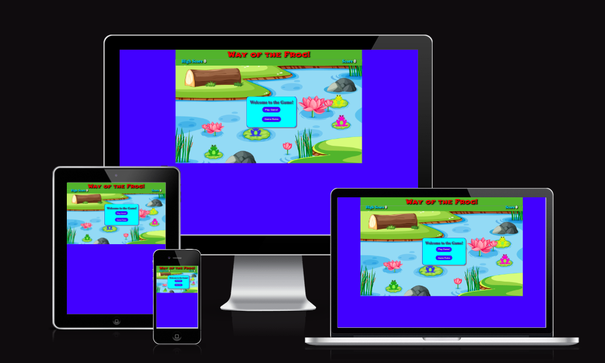
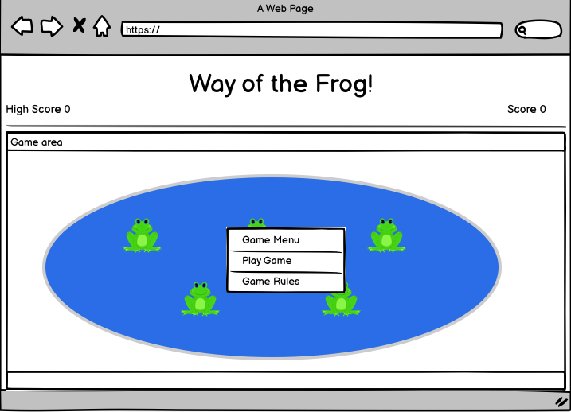

# Way of the Frog Memory Game

Follow the order that the frogs are played.  When you get it right your score acrues and the sequence gets longer.  Keep going until you make a mistake and try to beat your high score.

Link to [Live site](https://steve-doc.github.io/way_of_the_frog/)

Link to [Repository](https://github.com/steve-doc/way_of_the_frog)

## Index - Table of Contents

- [UX](#ux)
    - [Wireframes](#wireframes)
    - [Font and Colours](#font-and-colour-choices)

- [Features](#features)
    - [Existing Features](#existing-features)
    - [Future Features](#possible-future-features)

- [UX](#ux)
    - [Site Goals](#site-goals)
    - [User Stories](#user-stories)

- [Testing](#testing)
    - [Validator Testing](#validator-testing)
    - [Browser Testing](#browser-testing)
    - [Manual Testing](#manual-testing)
    - [Testing User Stories](#testing-user-stories)
    - [Fixed Bugs](#fixed-bugs)
    - [Unfixed Bugs](#unfixed-bugs)

- [Deployment](#deployment)

- [Credits](#credits)
    - [Media](#media)
    - [Code](#code)
    - [Content](#content)

## UX

### 1. Strategy
Build a simple, fun and challenging memory game that will engage the player.  The theme of the game will be a series of colourful frogs set on a lilly pond.
### 2. Scope
The player will 'listen' to frogs that will ribbet and be visulally highlighted in a random order.  The player will then have to play back, or 'follow', the same order by clicking on the frogs.  
 The game will get harder by the addition of more frogs each time the user succesfully completes the current sequence. 
 The player will accrue 1 point for every correct frog clicked.  
 The game is over when the player makes a mistake.  At this point their score will be compared to the current high score.  A different game over message will be displayed depending on whether the play fails to, equals or beats the high score.

 #### User stories
 1. I want a visually appealing game. 
 2. I want simple instructions to understand the game.
 3. Game should be intuitive to play.
 4. Game should start off easy and get harder as I progress.
 5. There should be a clear scoring system.
 6. I should be able to track and beat a high score.

### 3. Structure
A simple one page structure will be used.  
A game menu will be displayed to begin with offering the player the opportunity to play the game or read the instructions for the game.
All in-game messages are in the form of hidden divs, already on the page which are switched on and off as required during game.
The header to contain the title and the scoring.
The game play area to contain the backdrop of a lilly pond and a series of 5 colored frogs, sitting on lillies.

### 4. Skeleton

### 5. Surface

Create a simple, colourful game area that interacts with the user in an inutuitive way and needs the minimum of instruction before commencing the game.

#### Background

Background pond image was sourced from vecteezy.com and has a simple cartoon feel to it.  To compliment the theme of the pond I used blue #0100FF forder to surround the game area.

Credit
Pond background image - https://www.vecteezy.com/vector-art/521836-a-pond-with-many-plants 
frog sounds - https://quicksounds.com/search/filter/tracks/frog and edited with Vector 2 Exress

bugs

1. Intermittent on click audio bug not playing audio
2. When playing audio sequence if there are repeats of the same audio it will only play the audio once.
3. Score incrementing by multiples after first game.  Event listeners getting added again.