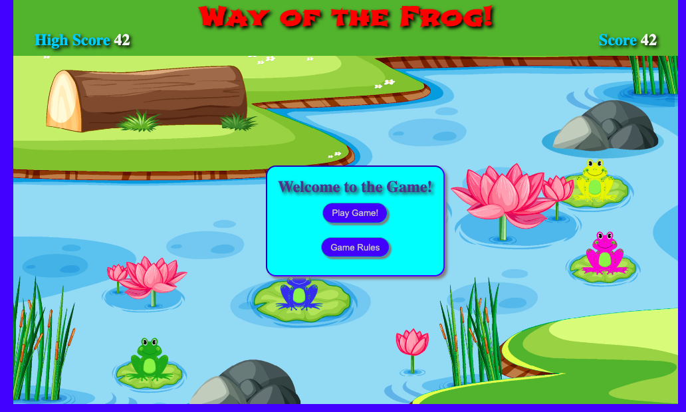
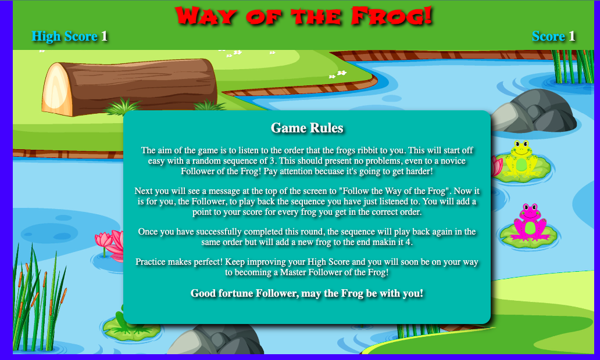
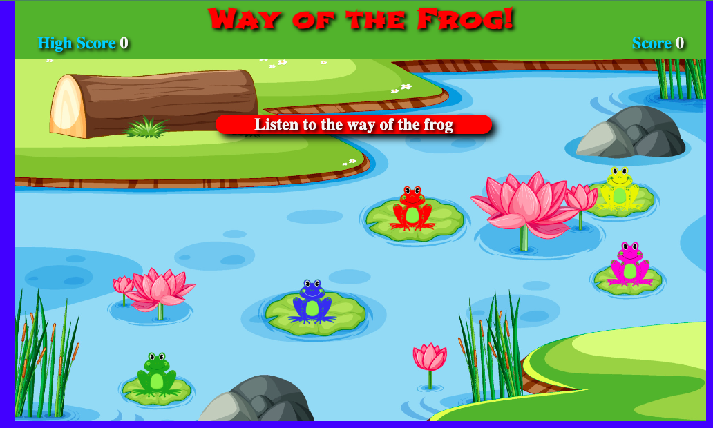
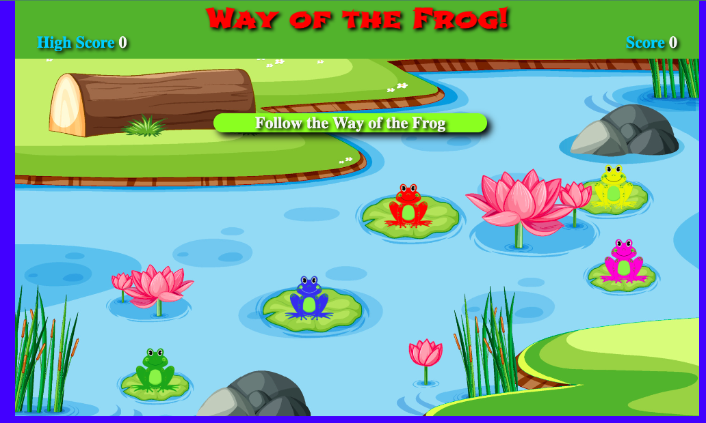
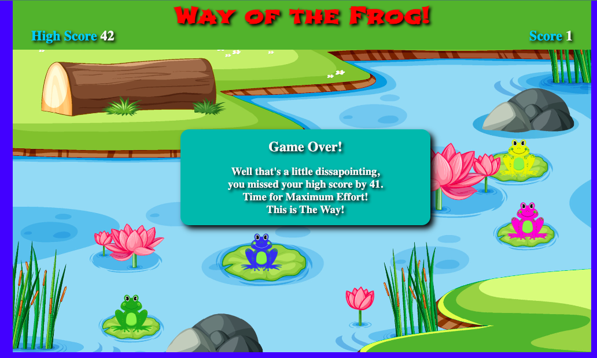
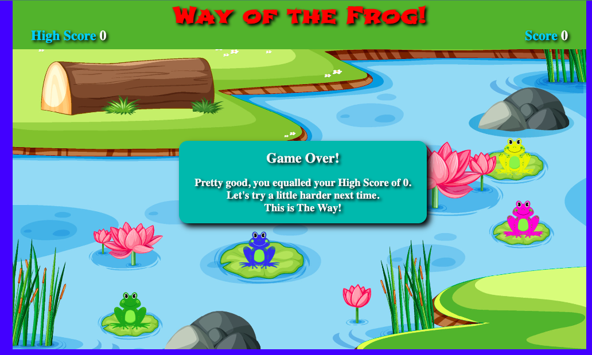
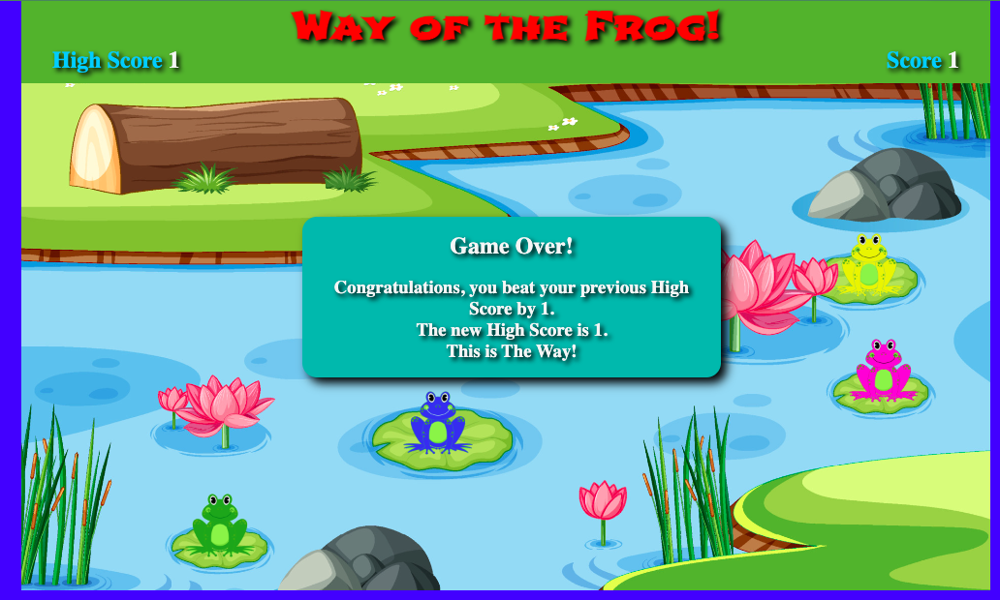
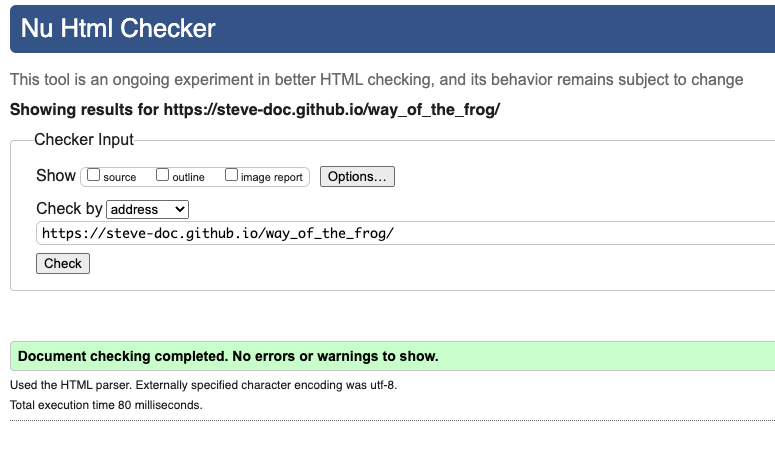
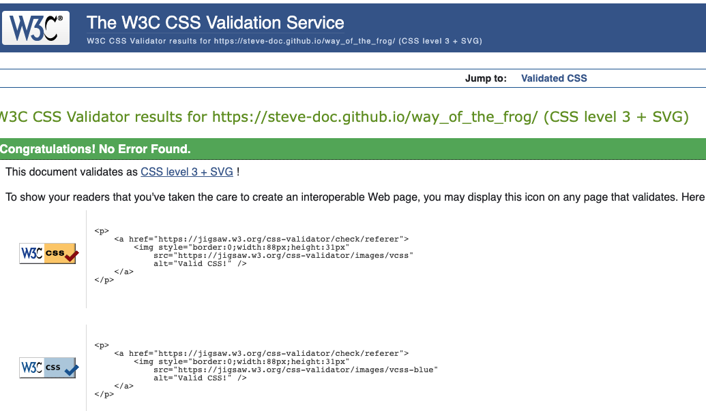
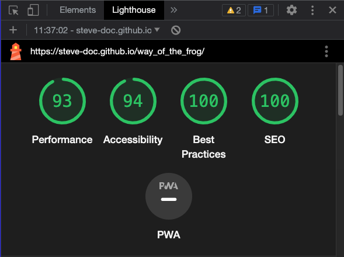

# Way of the Frog Memory Game

Follow the order that the frogs are played.  When you get it right your score acrues and the sequence gets longer.  Keep going until you make a mistake and try to beat your high score.

Link to [Live site](https://steve-doc.github.io/way_of_the_frog/)

Link to [Repository](https://github.com/steve-doc/way_of_the_frog)

## Index - Table of Contents

- [UX](#ux)
    - [Strategy](#strategy)
    - [Scope](#scope)
    - [Structure](#structure)
    - [Skeleton](#skeleton)
    - [Surface](#surface)

- [Features](#features)
    - [Existing Features](#existing)
    - [Future Features](#future)

- [Technology Used](#technology)

- [Testing](#testing)

- [Accessibility Features](accessibility)

- [Deployment](#deployment)

- [Credits](#credits)

## <a name="ux">UX</a>

### <a name="strategy">Strategy</a>
Build a simple, fun and challenging memory game that will engage the player.  The theme of the game will be a series of colourful frogs set on a lilly pond.

### <a name="scope">Scope</a>
The player will 'listen' to frogs that will ribbet and be visulally highlighted in a random order.  The player will then have to play back, or 'follow', the same order by clicking on the frogs.  
 The game will get harder by the addition of more frogs each time the user succesfully completes the current sequence. 
 The player will accrue 1 point for every correct frog clicked.  
 The game is over when the player makes a mistake.  At this point their score will be compared to the current high score.  A different game over message will be displayed depending on whether the play fails to, equals or beats the high score.

 #### User stories
 1. I want a visually appealing game. 
 2. I want simple instructions to understand the game.
 3. Game should be intuitive to play.
 4. Game should start off easy and get harder as I progress.
 5. There should be a clear scoring system.
 6. I should be able to track and beat a high score.

### <a name="structure">Structure</a>
A simple one page structure will be used.  
A game menu will be displayed to begin with offering the player the opportunity to play the game or read the instructions for the game.
All in-game messages are in the form of hidden divs, already on the page which are switched on and off as required during game.
The header to contain the title and the scoring.
The game play area to contain the backdrop of a lilly pond and a series of 5 colored frogs, sitting on lillies.

### <a name="skeleton">Skeleton</a>

### <a name="surface">Surface</a>

Create a simple, colourful game area that interacts with the user in an inutuitive way and needs the minimum of instruction before commencing the game.

#### Background

Background pond image was sourced from vecteezy.com and has a simple cartoon feel to it.  To compliment the theme of the pond I used blue #0100FF forder to surround the game area.

#### Fonts

Have used Shojumaru from Google Fonts for title to give an oriental feel to the game in keeping with name which hints at a martial art.  Hhave used default text style for the limited menu, messages and scores to aid in respnsiveness.

## <a name="features">Features</a>

### <a name="existing">Existing features</a>

- Game Menu
    - Appears when game loads.
    - Option to play game.
    - Option to view game rules.
    - Dissapears when either of above options chosen.
    - Reappears after game over of finished reading rules.

- Heading
    - Game title.
    - Brightly colored and in style in keeping with game theme.

- Score
    - Starts at zero for every new game.
    - increments by 1 for every correct frog selected.

- High Score
    - Starts at zero when game is initially run.
    - Update if player beats current high score.  Remembers high score until session is finished or broweser is refreshed.

- Game rules
    - Appear when user select "Game Rules" from game menu.
    - Dessapears when user clicks on rules then returns to main menu.

- Game backdrop
    - Cartoon image of lilly pond with 5 water lillies.
    - Sourced from https://www.vecteezy.com

- Frogs
    - Cartoon frog image, sourced from https://www.vecteezy.com
    - Image edited to remove background color and change individual color, creating 5 different frog images for game.
    - Each frog sits on a water lilly and, using relative positions stays on lilly as screen resizes.

- Audio
    - 5 different frog audio sounds sourced from https://quicksounds.com are associated with each frog.

- Game play
    - The game play is very simple.  A random sequence of frogs is first played to the player (listen phase) then the player has to click the frogs in the same sequence (follow phase).  If this is done succesfully another round starts adding another random frog to the sequence.  This is repeated until player makes a mistake.
    - Listen phase - a banner appears in red to instruction the user to listen to the sequence of frogs.  User input is blocked in this phase.  At the end of the sequence the banner dissapears.
    
    - Follow phase - a green banner appears to instruct the player to playback the sequence.  User input is enabled.  Banner dissapears either when the player succesfully replays the sequence or makes a mistake.
    
    - Score - The score increments by 1 every time the user succesfully clicks a frog in the correct sequence during the Follow phase.

- Game over
    - The game is over when the player clicks a frog out of sequence.
    - Three different Game Over messages can be displayed depending on the score achieved by the player compared to the high score.  A unique message is displayed when either a lower, equal or higher the current high score is achieved.
    - If new high score is achieve the on screen high score is updated to reflect that.
    - On clicking on the game over message the user is returned the game menu.

### <a name="future">Future features</a>

- High Score - I would add a high score option that is remembered from session to session.  This would require an external database/storage which is currently outside of the scope and my current learning.
- Additional game levels - A progression of game with perhaps more frogs and faster speeds to make game more difficult as player progresses.
- Two player option - The ability to play against another human.

## <a name="technology">Technology Used</a>
### Html
Used to structure my webpages.

### CSS
Used to provide style, layout and responsiveness to my website.

### JavaScript
Used for the logic of the gameplay and to update the DOM based on game updates and specific conditions.

### Google Fonts
Used for all the fonts on my website. Fontjoy website was used to find complimentary fonts.

### XnViewMP Photo Editing Software
Used for sizing, cropping and format coversion of images.

## <a name="testing">Testing</a>

### HTML [W3C HTML validator](https://validator.w3.org/)

### CSS [W3C CSS validator](https://jigsaw.w3.org/css-validator/)

- JavaScript [JSHint](https://jshint.com/)

No significant issues.

### Browser testing

#### Layout

Testing layout and appearance of game for consistency throughout browsers.

#### Functionality
- Testing complete functionality of the game. Includes
    - Game loads
    - Menu works
    - Game plays as expected 
    - Audio
    - Score increments
    - High Score updates
    - 3 different game over scenarios complete as expected
    - Rules display

    | Browser     | Layout      | Functionality |
    | :---------: | :----------:| :-----------: |
    | Chrome      | ✔          | ✔             |
    | Edge        | ✔          | ✔             |
    | Firefox     | ✔          | ✔             |
    | Safari      | ✔          | ✔             |

#### Performance testing

Using Chrome Dev Tools Lighthouse

#### Testing User Stories

Tested by 10 unique players on different devices and screen sizes.

| Expectation   | Result    |
| :---------------------------------: | :------------------------------:|
| I want a visually appealing game. | Games has colorful cartoon like feel.  Clear images and visual and audio feedback on interaction with game components. |
| I want simple instructions to understand the game. | Games instructions are immediately accessable from main menu. Instructions are clear. Also ingame cues help with gameplay. |
| Game should be intuitive to play. | Testers were able to consistently play game without reading instructions |
| Game should start off easy and get harder as I progress. | Games starts with simple 3 frog sequence and progressively gets longer. Verbally told users of previous high score and this made them quite competative. Would have been aided with future ability to have pervasive high score functionality |
| There should be a clear scoring system. | Very simple scoring system, always visible and increments 1 at a time. |
| I should be able to track and beat a high score. | High score works well although only lasts for current session.  Would improve with pervasive hagh score functionaility |

### Fixed bugs

1. Intermittently when clicking on frog audio not playing.
    - Resolved by using Howl audio library to store audio files in an array.
2. When playing audio sequence if there are repeats of the same audio it will only play the audio once.
    - Had to overcome the asynchronos nature of Javascript and prevent playing audio files simultaniously.  Credit to my mentor, Brian Macharia who helped me understand how to use setInterval function to overcome this.
3. Score incrementing by multiples after first game.  Event listeners getting added again.
    - Discovered that additional event listeners were getting created on each running of the game which triggered the score getting incremented multiple times.  Move event listener outside of game function so were only created once.

### Unresolved bug

1. Audio feedback seems to be inconsistent on certain mobile devices.  However had added visual feedback on same action so game still playable.

## <a name="accessibility">Accessibility Features</a>

* All images have alt labels
* Care has been taken to ensure good contrast between text and back ground colors
* Have used semantic html throughout

## <a name="deployment">Deployment</a>

This site was deployed via GitHub pages using the following steps:
- From the GitHub repository, navigate to **Settings**
- In the left-hand navigation section select **Pages**
- From the source section drop-down menu change Branch from **none** to **main** and click the **Save**
- After several minutes the website is live and will be automatically refreshed with each Git push command.

The link to the [live site](https://steve-doc.github.io/way_of_the_frog/)

To run locally:
- Log into GitHub and click on repository to download [Way of the Frog](https://github.com/steve-doc/way_of_the_frog)
- Select **Code** and click "Download the Zip file.
- Once download is completed, extract ZIP file and use in your local environment.

Alternatively you can **Clone** or **Fork** this repository into your GitHub account.

## <a name="credit">Credit</a>

Pond background image - https://www.vecteezy.com/vector-art/521836-a-pond-with-many-plants 
frog sounds - https://quicksounds.com/search/filter/tracks/frog and edited with Vector 2 Exress

